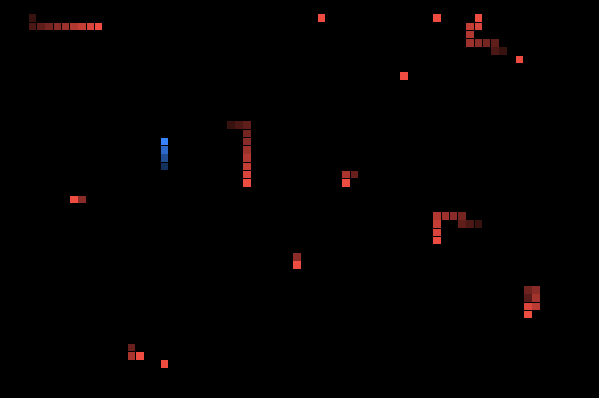

# CPUSnake

macOS screensaver that visualizes CPU and GPU activity as random-walking snakes
made of "cursor" cells. Each red snake represents one physical CPU core; one
blue snake represents the GPU. Snake length scales with utilization.



## Design

### Visual model
- Solid black background (configurable).
- Grid of square "cursor" cells (default 12 pt).
- One **red** snake per physical CPU core. Length = `utilization × maxLength`.
- One **blue** snake for the GPU (aggregate). Length = `gpuUtilization × maxLength`.
- Snakes step once per second by default. Each step they continue forward (50%),
  turn left (25%), or turn right (25%) — never reverse. Edges wrap around.
- Heads are fully opaque; body cells fade toward a translucent tail (gradient
  implemented via alpha falloff).

### Sources of truth
- **CPU per-core utilization** — `host_processor_info(PROCESSOR_CPU_LOAD_INFO)`
  deltas between samples; logical cores grouped to physical via
  `sysctl hw.physicalcpu`. On Apple Silicon the mapping is 1:1.
- **GPU utilization** — IOKit, matching `IOAccelerator` services, reading
  `PerformanceStatistics["Device Utilization %"]`. Same source Activity Monitor
  uses; no `sudo`, no private frameworks.

### Why one GPU snake, not per-core
The public `IOAccelerator` API only exposes an aggregate `Device Utilization %`.
Per-GPU-core breakdowns require private frameworks (`IOReport`). Spec deviation
documented here so it isn't lost.

### File layout
| File | Role |
|---|---|
| `Sources/CPUSnake/SnakeView.swift` | `ScreenSaverView` subclass; timer, drawing, configure sheet wiring |
| `Sources/CPUSnake/Snake.swift` | snake model: cells, random-walk step, draw |
| `Sources/CPUSnake/CPUSampler.swift` | per-physical-core utilization |
| `Sources/CPUSnake/GPUSampler.swift` | aggregate GPU utilization |
| `Sources/CPUSnake/Preferences.swift` | persisted settings via `ScreenSaverDefaults` |
| `Sources/CPUSnake/ConfigureSheet.swift` | preferences UI (programmatic AppKit) |
| `Sources/CPUSnake/Info.plist` | bundle metadata; `NSPrincipalClass = SnakeView` |
| `build.sh` | compiles Swift sources into `.saver` bundle, ad-hoc signs |
| `install.sh` | copies bundle into `~/Library/Screen Savers/` |
| `preview.swift` | runs `SnakeView` in a regular window for non-invasive testing |
| `test_load.swift` | smoke test: load bundle, instantiate, animate 3 s |

### Preferences
Exposed in the configure sheet (System Settings → Screen Saver → Options…):

- Cell size (6–24 pt)
- Max snake length (5–80 cells)
- Step interval (0.25–3.0 s)
- Show GPU snake (toggle)
- CPU color, GPU color, background color (`NSColorWell`)

Stored via `ScreenSaverDefaults` under module `com.noppadon.CPUSnake`.

## Install (prebuilt)

Download `CPUSnake-vX.Y.Z.zip` from the
[Releases page](https://github.com/aiesrocks/cpu-snake/releases), unzip, and:

```bash
mv ~/Downloads/CPUSnake.saver ~/Library/Screen\ Savers/
xattr -dr com.apple.quarantine ~/Library/Screen\ Savers/CPUSnake.saver
```

The `xattr` step is required because the bundle is **ad-hoc signed** (no Apple
Developer ID). Without it, Gatekeeper blocks loading. Alternatively, right-click
the `.saver` in Finder → **Open** and dismiss the warning once.

> Only `com.apple.quarantine` blocks loading, so `xattr -dr com.apple.quarantine …`
> is sufficient. You do **not** need the broader `xattr -cr …` (which clears
> every extended attribute). The `com.apple.provenance` attribute that downloads
> also carry is informational and does not block Gatekeeper.

Then open **System Settings → Screen Saver → Other → CPUSnake**.

## Terminal version

A CLI version of the same visualization, for running in any terminal instead of
as a screensaver.

```bash
./build-cli.sh
./build/cpu-snake
```

Ctrl-C to quit. The terminal window is resized live (`SIGWINCH`).

### How it renders
Each terminal character carries two stacked "pixels" using the Unicode upper
half-block (`▀`): top half via foreground color, bottom half via background
color. That doubles vertical resolution and keeps cells near-square. A 120×40
terminal therefore yields a 120×80 snake grid.

Requires a terminal with **24-bit truecolor** support (Terminal.app, iTerm2,
Ghostty, Alacritty, Kitty, WezTerm — all fine). Check with `echo $COLORTERM`;
if it says `truecolor` or `24bit`, you're set.

### Options
- `CPU_SNAKE_INTERVAL=0.5 ./build/cpu-snake` — step interval in seconds (default 1.0).

## Build from source

Requires Xcode command-line tools (Swift 5.9+, Apple Silicon recommended).

```bash
./build.sh
```

Produces `build/CPUSnake.saver`.

## Test without installing

Open the screensaver in a regular resizable window:

```bash
swift preview.swift build/CPUSnake.saver
```

Watch, resize, ⌘Q to quit. Nothing installed.

Smoke test (headless; verifies the bundle loads, the principal class
instantiates, and 3 s of frames run without crashing):

```bash
swift test_load.swift build/CPUSnake.saver
```

## Install

Symlink (easiest to remove, picks up rebuilds automatically):

```bash
ln -sf "$(pwd)/build/CPUSnake.saver" ~/Library/Screen\ Savers/CPUSnake.saver
```

Or a real copy:

```bash
./install.sh
```

Then open **System Settings → Screen Saver → Other → CPUSnake**.
Click **Options…** for the preferences sheet.

### Uninstall

```bash
rm -rf ~/Library/Screen\ Savers/CPUSnake.saver
```

## Caveats

- **GPU = single snake.** The OS only exposes aggregate GPU utilization without
  private APIs. To render N blue snakes all driven by the same aggregate value,
  edit `rebuildSnakes()` in `SnakeView.swift`.
- **Apple Silicon recommended.** GPU sampling relies on
  `IOAccelerator/PerformanceStatistics`, which is universal on Apple Silicon
  and most Intel Macs.
- **Ad-hoc signed.** Fine for personal use. Distribution to other Macs would
  require a Developer ID and notarization.
- **macOS 13+** required (`LSMinimumSystemVersion`).
